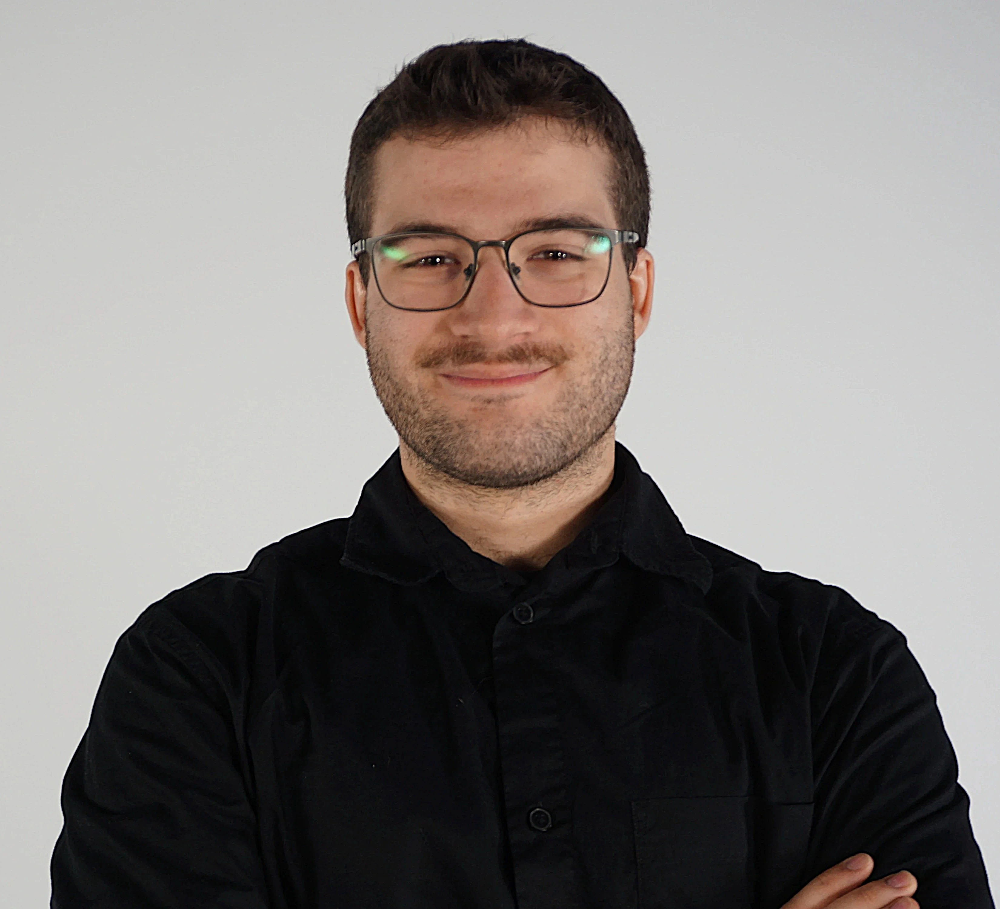

    

## Planification

Cette section, complétée lors de la première semaine, présente les tâches individuelles **hebdomadaires** prévues.

<!--
- Planification sur 9 semaines (8 semaines de cours et 1 semaine de rattrapage) présentant les tâches individuelles hebdomadaires prévues.
- Au moins une tâche par semaine. Les tâches ne peuvent pas se répéter et doivent être suffisamment précises.
- Les tâches doivent être cohérentes avec celles des autres membres de l’équipe et avec le concept du projet, et être mises à jour en continu.
- Critères :
    - Intention et concept clairs
    - Description approfondie de la conception sonore et visuelle
    - Planification détaillée du contenu multimédia à intégrer
    - Planification technique rigoureuse
-->

### Semaine 1

- Travailler sur ma page dans équipe
- Faire le plan du cadre de bois
- Calculer les coûts approximatifs du bois
- Chercher pour une toile en spandex

### Semaine 2

- Compléter ma page dans équipe
- Commander la toile
- Faire le plan et calculer le prix du cadre en aluminium
- Expérimenter avec le lidar pour avoir les bons paramètres de distance pour la toile temporaire
- Faire la liste de matériel nécessaire aux TTP
- Faire une v1 pour le face tracking qui fonctionne pour 1 visage à la fois
<!-- 
- Tâche
- Tâche
-->

### Semaine 3

- Amener l'aluminium à l'école
- Installer la toile (peut-être)
- Préparer la démo
- Commencer à faire une v2 pour le face tracking pour avoir 2 visages à la fois
<!-- 
- Tâche
- Tâche
-->

### Semaine 4

- Construire le cadre en aluminium lorsqu'on aura reçu toutes les pièces
- Faire en sorte que le face tracking fonctionne avec au moins 3 visages en même temps
<!-- 
- Tâche
- Tâche
-->

### Semaine 5

- Résoudre certains problèmes potentiels avec le face tracking et le lidar
- Travailler sur la bande-annonce
- Travailler sur le dossier de presse
- Se préparer pour la présentation de la semaine 6
<!-- 
- Tâche
- Tâche
-->

### Semaine 6

- Faire la présentation
- Faire les possibles améliorations sur le projet
<!-- 
- Tâche
- Tâche
-->

### Semaine 6.5

- Travailler sur la vidéo finale
- Continuer à améliorer le projet
<!-- 
- Tâche
- Tâche
-->

### Semaine 7

- Remplir la section exposition
- Résoudre les problèmes
- Prier pour que rien explose
<!-- 
- Tâche
- Tâche
-->

### Semaine 8

- Présenter l'installation
- Finir la vidéo finale
- Compléter le site web
<!-- 
- Tâche
- Tâche
-->

## Journal de bord

Cette section, complétée **quotidiennement** pendant l’exécution du projet, documente le travail individuel réellement réalisé chaque jour.

<!--
- Une entrée par jour sur 8 semaines (8 semaines à partir de la semaine 2).
   - Un total d'au moins 40 entrées uniques!
- Chaque jour :
    - Documentstion visuelle et/ou sonore du travail effectué
    - Lien vers les billets GitHub résolus
- Démarche rigoureuse de validation de la qualité
- Démonstration d'autonomie.
- Exécution technique précise et complète.
- Évaluation réfléchie de la contribution individuelle au travail d’équipe.
-->

### Semaine 2

#### Lundi
26 janvier: Je suis venu à l'école pour faire la planification dans le GitHub et pour résoudre certaines erreurs dans le site.

#### Mardi
27 janvier: En matinée, on a fait notre pitch avec les révisions faites la semaine dernière (soleil + inondation). En après-midi, on a fait une v1 de la structure avec le frame pour fond vert et une toile que Antoine nous a donné. On a fait un test avec le projecteur pour voir s'il était capable de projeter au travers de la toile.

#### Mercredi
28 janvier: On a défait la v1 et on a construit la structure v2 sur le mur de fond du studio. J'ai installé le lidar et le Raspberry Pi avec des "raidins" sur la structure. J'ai fait le plan pour le métal et j'ai acheté la quantité nécessaire d'aluminium pour le cadre ainsi que la toile.

#### Jeudi
29 janvier: Je suis allé chez Guillaume avec Jade pour aller chercher des extrusions d'aluminium ainsi que des télévisions cathodiques pour son projet à elle. J'ai ensuite fait un prototype de face tracking avec un Sony 6500 comme caméra.

#### Vendredi
30 janvier: Mik et moi avons fait un système pour que l'appareil photo voit les gens dans le portique du studio. Il détecte seulement les visages si ceux-ci sont dans le portique.

### Semaine 3

#### Lundi
2 février: Je n'ai pas travaillé sur le projet.

#### Mardi
3 février: J'ai reçu les coins ajustables et les extrusions d'aluminium pour la structure et j'ai voulu faire des filets dans les extrusions d'aluminium, mais j'ai brisé la mèche dans l'extrusion. Je suis allé voir au Rona+, au Canadian Tire et au Home Depot et ils n'en vendent pas. J'ai ensuite installé les haut parleurs et la carte de son pour le projet.

#### Mercredi
4 février: J'ai installé les extensions de métal pour les extrusions d'aluminium. J'ai coupé certaines extrusions pour avoir certaines mesures spécifiques. J'ai ensuite mis l'effet d'eau au toucher de la toile.

#### Jeudi
5 février: Portes ouvertes. J'ai ramassé le studio et j'ai participé aux portes ouvertes.

#### Vendredi
6 février: Je n'ai pas travaillé sur le projet.

### Semaine 4

#### Lundi
9 février: Je n'ai pas travaillé sur le projet.

#### Mardi
10 février: J'ai assemblé le restant de la structure avec les coins à 90 degrés.

#### Mercredi
11 février: J'ai sablé les attaches pour la toile. On a installé la toile. On a défait la v2 de la structure et on a installé la structure finale.

#### Jeudi
12 février: J'ai arrangé la calibration du lidar et j'ai travaillé sur une version du face tracking pour capter les visages plus sombres et les rendre plus lumineux.

#### Vendredi
13 février: Je n'ai pas travaillé sur le projet.

### Semaine 5

#### Lundi
16 février: On a enlevé le faux mur du studio pour pousser le cadre plus proche du mur. Mikael et moi avons corrigé la projection pour que celle-ci prenne toute la grandeur de la toile. 

#### Mardi
17 février: On a rajouté d'autres attaches sur le cadre pour tenir la toile. J'ai installé un rideau noir en dessous de la projection pour cacher les fils et le projecteur. J'ai fait une amélioration au face tracking pour que si la photo prise est trop sombre, celle-ci est éclaircie.

#### Mercredi
18 février: J'ai attaché la caméra au support arrière du cadre avec un SmallRig pour ne pas avoir à utiliser un trépied. Je suis allé acheter 11 mètres de rideau noir au Fabricville avec Jade pour nos deux projets respectifs. On a coupé le tissu dans les mesures nécessaires à l'aide du niveau à laser. J'ai commencé un schéma plus détaillé du cadre pour la documentation.

#### Jeudi
19 février: J'ai installé les rideaux noirs sur les cotés du cadre avec des tringles à rideaux faites avec les extrusions d'aluminium restantes en les attachant au dessus du cadre avec les 2 coins à 90 degrés qu'il me restait. Malheureusement, le rideau étant lourd, les tringles penchait trop vers l'arrière et manquait de briser les coins. J'ai donc fait un système de support avec deux extrusions d'aluminium restantes que j'ai fileté et des SmallRig pour tenir les tringles avec la gravité. J'ai fini le schéma du cadre avec des liens pour chaque élément du cadre. De plus, j'ai aussi réajusté les paramètres de la caméra et du face tracking puisque nous avions bougé le cadre lundi. Nous avons aussi fait la bande-annonce en format "reels".

#### Vendredi
20 février: Je n'ai pas travaillé sur le projet

### Semaine 6

#### Lundi
23 février: Nous sommes venu à l'école, mais il y a eu une panne du réseau, donc nous sommes parti.

#### Mardi
24 février: Nous avons présenté aux élèves de première année pendant le diner.

#### Mercredi
25 février: J'ai installé des cables ethernet, xlr et électrique dans le plancher en enlevant une dalle du studio. J'ai fait passer les cables par le placard du portique du studio pour ensuite les faire passer dans le plafond. J'ai installé des lumières comme dans le studio avec une autopole, mais le résultat n'était pas celui escompté, donc j'ai enlevé la pole et les lumières.

#### Jeudi
26 février: J'ai installé avec Alex un canon lumineux en haut de la porte du studio pour éclairer les visages plus efficacement.

#### Vendredi
27 février: Je n'ai pas travaillé sur le projet.

### Semaine 6.5

#### Lundi
2 mars: Je n'ai pas travaillé sur le projet.

#### Mardi
3 mars: J'ai installé la lumière hélicoidale au plafond avec Alex pour éclairer les visages pour prendre de meilleures photos. 

#### Mercredi
4 mars: J'ai créé le fichier QLC+ pour gérer la lumière et j'ai commencé un script sur le raspberry pi du lidar pour allumer et éteindre la lumière au démarrage et à la fermeture respectivement de celui-ci. Malheureusement, nous avons remarqué que la lumière aveuglait les gens et que si nous baissions l'intensité de celle-ci, les photos seraient trop sombres. Alex et moi avons donc enlevé la lumière.

#### Jeudi
5 mars: Je n'ai pas travaillé sur le projet.

#### Vendredi
6 mars: Je n'ai pas travaillé sur le projet.

### Semaine 7

#### Lundi
9 mars: Je n'ai pas travaillé sur le projet.

#### Mardi
10 mars: Guillaume nous a suggéré d'utiliser les caméras de Quand les yeux se croisent pour prendre nos photos puisqu'ils ont déjà le bon éclairage pour filmer des visages. J'ai pris le feed vidéo de leurs caméras par NDI et j'ai mis installé notre système de face tracking dans cette image. J'ai aussi compléter mon script pour allumer et éteindre la lumière, mais cette fois-ci pour les lumières d'Émersia qui éclairent les visages des participants. Malheureusement, Félix a voulu simplifier comment ses lumières intéragissent avec les canaux de l'univers lumineux, donc nous avons du mettre la gestion de ces lumières avec le même QLC+ du reste du studio par ArtNet. J'ai donc fait un script qui envoie un message on/off par OSC au pi qui s'occupe des lumières du studio pour que ceux-ci s'allument avec le démarrage et la fermeture de mon raspberry pi. J'ai aussi coupé l'extra de métal sur le raidin qui tient le lidar en haut de la toile.

#### Mercredi
11 mars: Nous ne sommes pas venus à l'école à cause de la tempête de verglas.

#### Jeudi

#### Vendredi

### Semaine 8

#### Lundi

#### Mardi

#### Mercredi

#### Jeudi

#### Vendredi
                                                   
