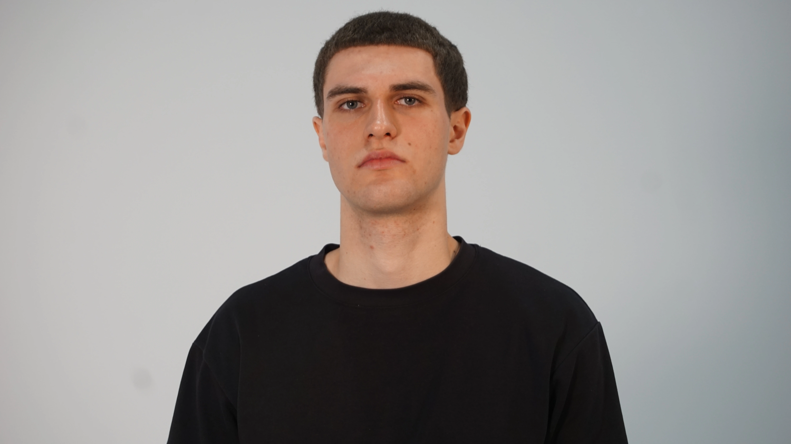

# Matis Ghariani

## Planification

Cette section, complétée lors de la première semaine, présente les tâches individuelles **hebdomadaires** prévues.

<!--
- Planification sur 9 semaines (8 semaines de cours et 1 semaine de rattrapage) présentant les tâches individuelles hebdomadaires prévues.
- Au moins une tâche par semaine. Les tâches ne peuvent pas se répéter et doivent être suffisamment précises.
- Les tâches doivent être cohérentes avec celles des autres membres de l’équipe et avec le concept du projet, et être mises à jour en continu.
- Critères :
    - Intention et concept clairs
    - Description approfondie de la conception sonore et visuelle
    - Planification détaillée du contenu multimédia à intégrer
    - Planification technique rigoureuse
-->

### Semaine 1

- Travailler sur la page github.

### Semaine 2

- Redéfinir l'identitée du projet (scénario, etc)
- Trouver des inspirations pour l'ambiance (sons)
- Enregistrement de sons
- Faire le background de la toile
- Documentation du projet (photos, etc...)
- Commité design
- Installation du projet

### Semaine 3

- Se preparer pour les portes ouvertes.
- Commencer le mixage et l'addaptation des sons enregistrer.
- Documentation du projet (photos, etc...)
- Commité design (Logo).

### Semaine 4

- faire le soleil.
- Redesign du background...
- Animation du background
- Mixage et addaptation des sons enregistrer.
- Commité design (Logo).

### Semaine 5

- Mixage et addaptation des sons enregistrer.
- Créé l'ambiance sonore.
- Commité design (bannère, etc)
- Redesign du background...
- Faire le background (modelisation 3d)

### Semaine 6

- Mixage et addaptation des sons enregistrer
- Composer l'ambiance sonore
- Commité design
- Faire le background

### Semaine 6.5

- Mixage et addaptation des sons enregistrer.
- Composer l'ambiance sonore et le reste des sons.
- Commité design.

### Semaine 7

- Mixage et addaptation des sons enregistrer (finaliser)
- Leveling des sons
- Modélisation 3d (background)
- Animation de l'arc-en-ciel
- Correction de bugs et qualibrage du projet.
- Commité design.

### Semaine 8

- correction des bugs.
- Documentation du projet (photos, etc...)

## Journal de bord

Cette section, complétée **quotidiennement** pendant l’exécution du projet, documente le travail individuel réellement réalisé chaque jour.

<!--
- Une entrée par jour sur 8 semaines (8 semaines à partir de la semaine 2).
   - Un total d'au moins 40 entrées uniques!
- Chaque jour :
    - Documentstion visuelle et/ou sonore du travail effectué
    - Lien vers les billets GitHub résolus
- Démarche rigoureuse de validation de la qualité
- Démonstration d'autonomie.
- Exécution technique précise et complète.
- Évaluation réfléchie de la contribution individuelle au travail d’équipe.
-->

### Semaine 2

#### Lundi

- Répartition des tâches
- Plannification de la session

#### Mardi

- Installation pour test de projection
- Redéfinition de l'estetique sonore et visuelle du projet
- Moodboard du projet

#### Mercredi

- Installation pour test de projection (suite)
- Documentation (photos)
- Début de l'enregistrement des sons
  - Eau qui coule
  - Bruitages humains

#### Jeudi

- Enregistrement des sons
  - Oiseaux, criquets
  - Balloune
  - Cris
- Modification complète du scénario
- Documentation (vidéo)

#### Vendredi

- Background de la toile (premier design)

### Semaine 3

#### Lundi

#### Mardi

- Ajustement des sons
- Mixage des sons
  - Eau
  - Étirement
  - Plante qui boit

#### Mercredi

- Ajustement des sons
- Mixage des sons
  - Cris
  - Bruit de réussite
- Preparation pour les portes ouvertes

#### Jeudi

- Observation lors des portes ouvertes
- Documentation du projet (videos)

#### Vendredi

- Design du logo de l'exposition

### Semaine 4

#### Lundi

- Design du logo de l'exposition (suite)
- Remixage des sons
   - Eau 2
   - Cris

#### Mardi

- Design du soleil

#### Mercredi

- Design du soleil (suite)
- Redesign du background (deuxième design)

#### Jeudi

- Animation du background (deuxième design)

#### Vendredi

### Semaine 5

#### Lundi

- Enregistrement des sons
  - Sons joyeux

#### Mardi

- Modélisation 3d du background (troisième design)
  - Terrain

#### Mercredi

- Design de la bannière (comité design)

- Test de background sur Touchdesigner (terrain 3d, layers, etc) - (troisième design)

#### Jeudi

- Design de la bannière (comité design) - (suite)

- Modélisation 3d du background (troisième design)
  - Nuages
  - Montagnes
  - terrain 2

#### Vendredi

- Debut de la création et de l'ambiance de base
- Mixage de son
  - Plante completé

### Semaine 6

#### Lundi

- Création et mixage de l'ambiance de base

#### Mardi

- Présentation de la maquette 2 aux étudiants

#### Mercredi

- Mixage des sons

#### Jeudi

- Design du background (export 2, masquer, colorisation) - (troisième design)

#### Vendredi

- Finalisation de l'ambiance de base

### Semaine 6.5 (semaine de rattrapage)

#### Lundi

#### Mardi

#### Mercredi

#### Jeudi

#### Vendredi

### Semaine 7

#### Lundi

#### Mardi

- Modelisation 3d du background (troisième design)
- Design et mixage de sons
   - Éclaire

- Design affiche comité design

#### Mercredi

- Animation arc-en-ciel

#### Jeudi

- Animation arc-en-ciel (suite)
- Modelisation du terrain du background (troisième design)
  - Sol 2

- Qualibration des caméras chez « Quand les yeux se croisent »
- Création sonore
   - arc-en-ciel

#### Vendredi

- Correction des bugs sonores
- « Leveling » sonore du projet
- Qualibration des caméras chez « Quand les yeux se croisent » (suite)
- Design du background finale

### Semaine 8

#### Lundi

- Presentation du projet

#### Mardi

- Presentation du projet
- Prise de photos et de vidéos pour la documentation finale (vernissage)

#### Mercredi

- Presentation du projet
- Montage de la documentation finale

#### Jeudi

- Presentation du projet

#### Vendredi
