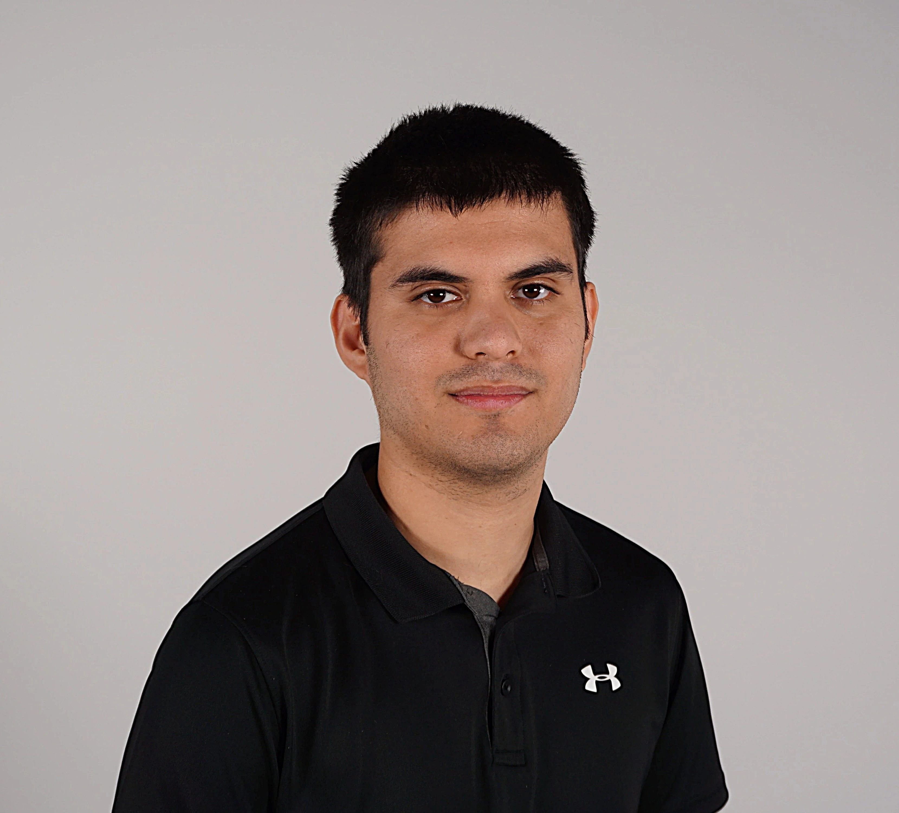

# Rafael Angon Dubé

## Planification

Cette section, complétée lors de la première semaine, présente les tâches individuelles **hebdomadaires** prévues.

<!--
- Planification sur 9 semaines (8 semaines de cours et 1 semaine de rattrapage) présentant les tâches individuelles hebdomadaires prévues.
- Au moins une tâche par semaine. Les tâches ne peuvent pas se répéter et doivent être suffisamment précises.
- Les tâches doivent être cohérentes avec celles des autres membres de l’équipe et avec le concept du projet, et être mises à jour en continu.
- Critères :
    - Intention et concept clairs
    - Description approfondie de la conception sonore et visuelle
    - Planification détaillée du contenu multimédia à intégrer
    - Planification technique rigoureuse
-->

## 📅 Planification du projet

### Semaine 1
- Travailler sur la création de la page GitHub  
- Magasiner et rechercher le matériel nécessaire au projet  

### Semaine 2
- Commencer la construction de la structure du projet  
- Rédiger la documentation sur GitHub et filmer l’évolution du projet  
- Trouver des idées de sons et des inspirations  
- Commencer la prise de photos et de vidéos  

### Semaine 3
- Finaliser la structure du projet  
- Commencer l’enregistrement et la production des sons (arbres, soleil, eau, etc.)  
- Continuer la documentation photo et vidéo  

### Semaine 4
- Modifier et ajuster les sons dans Reaper  
- Continuer la documentation photo et vidéo du projet  

### Semaine 5
- Faire le montage de la bande-annonce  
- Continuer la documentation photo et vidéo  

### Semaine 6
- Tester et intégrer les sons dans le projet  
- Déterminer la manière de présenter les cartels  
- Trouver une méthode pour imprimer les cartels  
- Assembler le cartel de l’équipe  
- Installer l’éclairage du cartel  

### Semaine 6.5
- Rédiger les informations à afficher sur les cartels  
- Tourner la vidéo de présentation du projet  

### Semaine 7

- Faire le montage de la vidéo de présentation
-  Vérifier que tout fonctionne correctement 

### Semaine 8
- Pratiquer pour la présentation finale  
- Vérifier que tout fonctionne correctement  

## Journal de bord

Cette section, complétée **quotidiennement** pendant l’exécution du projet, documente le travail individuel réellement réalisé chaque jour.

<!--
- Une entrée par jour sur 8 semaines (8 semaines à partir de la semaine 2).
   - Un total d'au moins 40 entrées uniques!
- Chaque jour :
    - Documentstion visuelle et/ou sonore du travail effectué
    - Lien vers les billets GitHub résolus
- Démarche rigoureuse de validation de la qualité
- Démonstration d'autonomie.
- Exécution technique précise et complète.
- Évaluation réfléchie de la contribution individuelle au travail d’équipe.
-->

### Semaine 2

#### Lundi
- instalation test pour la toile et la projection.

#### Mardi
- Installation et test de la toile et de la projection.
#### Mercredi
- Création de la liste des sons à faire et enregistrement avec le dispositif sonore.
- Première journée d’enregistrement audio : les sons enregistrés aujourd’hui sont : l'eau, les plantes qui bois, qui ce noit et cris de colère du soleil 
- Prise de photos du projet.
  
- Installation et test de la toile et de la projection.
#### Jeudi
- test du projet sur la toille 
- création de la parti conception sonore dans le site web
- achat de nouveau chose pour aider à faire les sons manquant(ballon de fête)
- enregistremment des derniès sont restant: Oiseaux, criquet, plante gradir (baloune), plant meurt (crit)
- ajout des nouveau croquis et texte sur le site 
  
#### Vendredi
- continuer la documentaion du projet
### Semaine 3

#### Lundi
- essayer de faire que touchdesigner peut lancer les son de reaper mais pas reussi il y a des bugs
- création des sons 
#### Mardi
- intégration du son dans le projet
- installation des haut parleur
- testé le projet
#### Mercredi
- commencer du tournage pour la bande annonce
- testé le projet
#### Jeudi
préparation pour les porte ouverts

#### Vendredi
journée congés 
### Semaine 4

#### Lundi
commencer à faire faire le tris des vidéo découpement etc
correction de mon journal de bord 
#### Mardi
continuer a toucher au montage video 
test du projet
#### Mercredi
- installation de la nouvelle toille refait tous l'emplacement du projet.
- refaire l'osc avec reaper
#### Jeudi
- enregistrement de nouveau de cris
- prise de photo
#### Vendredi
- journée de congé
### Semaine 5

#### Lundi
- déplacer la strcuture du projet
- prendre des photo
- premier rencontre avec le comité 
#### Mardi
- trouner des nouvelle scene pour le trailer
- continuer le montage
- prendre des photos
- tester le projet
#### Mercredi
- continuer le montage
- commencer le document de presse
- prendre des photos
- tester le projet
#### Jeudi
- finir le trailer
- prise de photo
- changement de desicion de l'équipe pour le tailer style plus tik tok
- tester le projet
#### Vendredi
- montage et sous-titre
### Semaine 6

#### Lundi
reunion avec le comminter 
#### Mardi
présentation du projet au éléve de premier année et écouter leurs commentaire
#### Mercredi
création du designe du cartel, j'ai créé plus model en tous 7 model on été crée
#### Jeudi
création des animations secrets qui sont cacher dans le projet arc-en-ciel,éclaire etc tous sur affet effect.
#### Vendredi
On a eu une rencontre du comité pour décider quel cartel choisir, et on a pris le numéro 2.
### Semaine 6.5

#### Lundi
 - journée de congé
#### Mardi
- correction des demande du prof sur le design du cartel 
- prise de photo
#### Mercredi

#### Jeudi

#### Vendredi

### Semaine 7

#### Lundi

#### Mardi

#### Mercredi

#### Jeudi

#### Vendredi

### Semaine 8

#### Lundi

#### Mardi

#### Mercredi

#### Jeudi

#### Vendredi
                                                   
